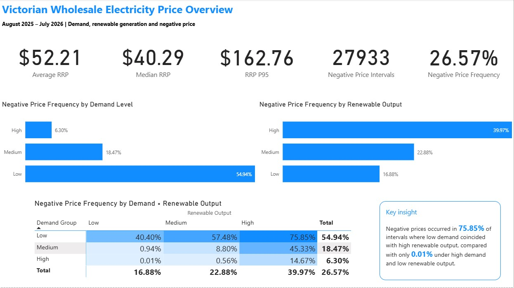
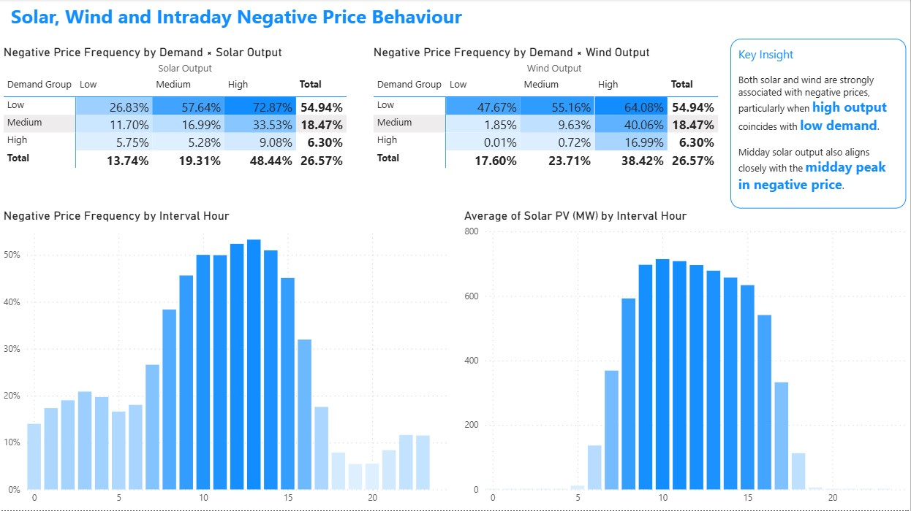
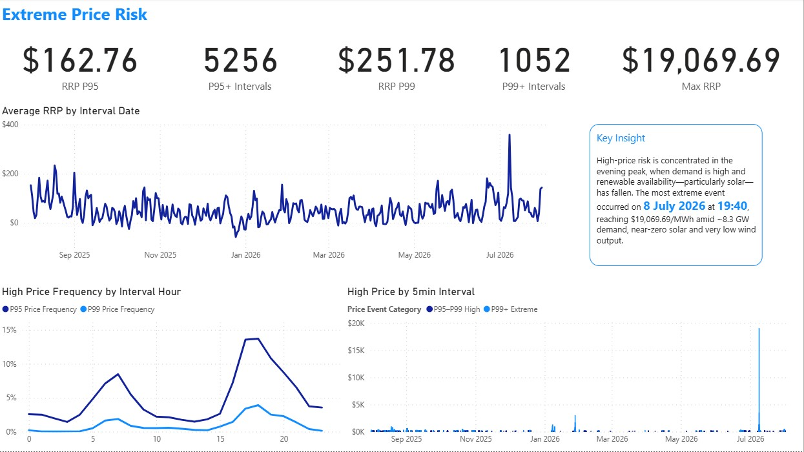
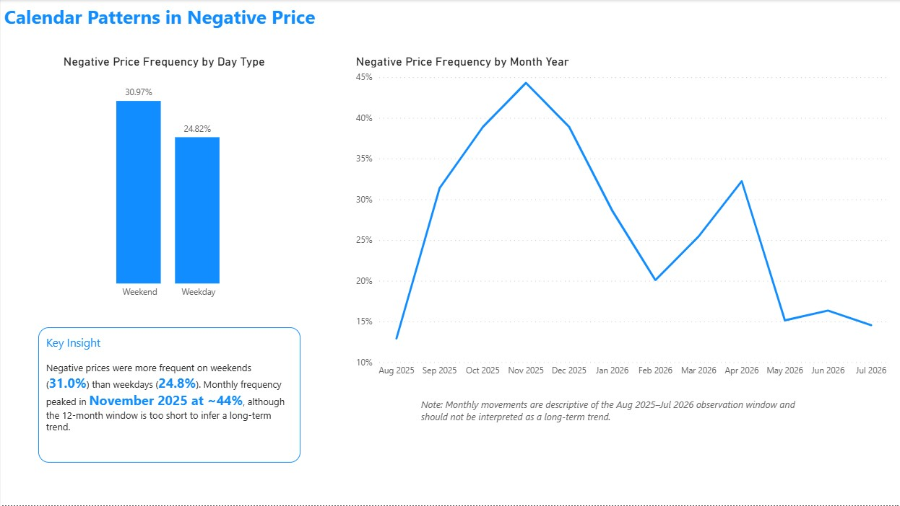

# Victorian Wholesale Electricity Price Analysis

### Portfolio project | Python, pandas, Power BI, DAX, Power Query, AEMO NEM data

## Overview

This project analyses Victorian wholesale electricity market conditions in the National Electricity Market (NEM) from August 2025 to July 2026.

The analysis focuses on how electricity demand, renewable generation, time of day and generation mix are associated with negative and extreme wholesale prices.

The project combines AEMO five-minute price, demand and unit-level generation data, processes the raw datasets using Python, and presents the findings in an interactive Power BI report.

---

## Business Questions

The analysis explores the following questions:

1. What does the distribution of Victorian wholesale electricity prices look like?
2. How frequently does Victoria experience negative prices?
3. Under what demand and renewable generation conditions are negative prices most common?
4. How are solar and wind generation associated with negative pricing?
5. Are negative prices concentrated at particular times of day?
6. When do extreme high-price events occur?
7. What market conditions are observed during extreme price events?
8. How do negative-price patterns differ between weekdays and weekends?
9. How does negative-price frequency vary across the observation period?

---

## Data Sources

Data was sourced from the Australian Energy Market Operator (AEMO).

### Price and Demand

AEMO Aggregated Price and Demand data for the VIC1 region.

Key fields:

- Settlement timestamp
- Regional Reference Price (RRP)
- Total Demand

### Generation

AEMO DISPATCHSCADA data was used to obtain five-minute unit-level generation values.

Generator DUIDs were mapped to technology types using AEMO Generation Information data.

Generation technologies analysed include:

- Coal
- Gas Turbine
- Hydro
- Solar PV
- Wind
- Battery Storage

The final analysis period covers:

**1 August 2025 to 31 July 2026**

---

## Data Processing

Python was used to process and validate the raw AEMO data.

The generation dataset required additional processing because daily DISPATCHSCADA archives contain 288 nested five-minute ZIP files.

The processing workflow included:

1. Downloading daily AEMO DISPATCHSCADA archives.
2. Extracting nested five-minute CSV files.
3. Parsing unit-level SCADA records.
4. Joining DUIDs to AEMO generator metadata.
5. Resolving differences in dataset grain before joining.
6. Filtering Victorian generation units.
7. Aggregating generation by technology type and timestamp.
8. Joining generation data with Victorian price and demand data.
9. Performing completeness, duplicate and timestamp validation.

The final dataset contains:

**105,120 five-minute market intervals**

A known AEMO SCADA data gap affected 20 generation intervals on 10 March 2026. These timestamps were retained using the Price and Demand dataset as the master timeline, with generation fields left missing rather than imputed.

---

## Key Findings

### Negative prices were common

Negative wholesale prices occurred in approximately **26.6% of five-minute intervals** during the observation period.

### Low demand was strongly associated with negative prices

Negative-price frequency was substantially higher during low-demand periods than during high-demand periods.

### Renewable output amplified negative-price conditions

Negative prices became particularly frequent when high renewable output coincided with low demand.

Approximately **75.9% of intervals with low demand and high renewable output recorded negative prices**.

### Solar and wind showed different patterns

Higher solar generation was strongly associated with negative prices, particularly during low-demand periods.

Wind generation also showed a strong association with negative pricing and remained influential across a broader range of demand conditions.

### Negative pricing followed a strong intraday pattern

Negative-price frequency increased sharply during daylight hours and peaked around midday, aligning closely with higher solar output.

### Extreme prices were concentrated in evening periods

High-price frequency was greatest during late-afternoon and evening periods when demand was elevated and solar output had fallen.

The maximum observed RRP was:

**$19,069.69/MWh at 19:40 on 8 July 2026**

At the time:

- Victorian demand was approximately 8.3 GW
- Solar output was near zero
- Wind output was very low
- Hydro, gas and battery generation were elevated

This pattern is consistent with tight evening supply-demand conditions, although other market factors such as network constraints, generator availability and bidding behaviour may also contribute to extreme prices.

### Weekends experienced more negative pricing

Negative-price frequency was approximately:

- **31.0% on weekends**
- **24.8% on weekdays**

Monthly negative-price frequency peaked around November 2025 within the observation period.

---

## Power BI Dashboard

### Market Overview



### Renewable and Intraday Behaviour



### Extreme Price Risk



### Calendar Patterns



---

## Tools

- Python
- pandas
- Power BI
- DAX
- Power Query
- AEMO NEMWeb
- Jupyter Notebook

---

## Analytical Approach

The project combines exploratory data analysis with market-domain interpretation.

Relationships identified in the analysis are treated as associations rather than causal relationships.

For example, high renewable generation is strongly associated with negative prices, but wholesale electricity prices are also influenced by:

- demand
- generator availability
- network constraints
- interconnector flows
- bidding behaviour
- storage activity
- operational conditions

---

## Limitations

The analysis covers a single 12-month observation period and should not be interpreted as evidence of long-term market trends.

The generation dataset primarily reflects registered generation visible in AEMO DISPATCHSCADA data and does not fully capture distributed rooftop solar generation.

Twenty five-minute generation intervals on 10 March 2026 were missing from the AEMO source data and were not imputed.

The analysis does not currently incorporate interconnector flows, constraint equations, outage data or bid-stack information.

---

## Repository Structure

```text
notebooks/
    01_data_processing.ipynb
    02_market_analysis.ipynb

powerbi/
    nem_vic_electricity_price_analysis.pbix

images/
    dashboard screenshots

data/
    data source notes
